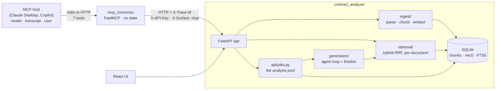

# The MCP connector

The fourth surface. `ui/` is the browser's, `api/` is everyone's, and this is
the one a chat client speaks: Claude Desktop, Copilot, or anything else that
talks MCP. It publishes seven tools over the same FastAPI the React app uses,
and it holds no state of its own.

Everything about this surface is in this directory — the server, the HTTP
client, the tool schemas, the tests and this document. It imports nothing from
`contract_analyzer`, because it is a *client* of that service rather than a part
of it, and a package that could import the analyzer would eventually open the
database and turn `CA_API_URL` into a suggestion.

```
MCP-Connector/
├── mcp_connector/
│   ├── server.py     the FastMCP server: instructions, seven tools
│   ├── client.py     the one path to the API: trace ids, the error envelope
│   ├── schemas.py    what a tool returns, and what it leaves out
│   └── config.py     .env for where things are, settings.json for tuning
└── tests/            offline, and against a real create_app()
```

## Running it

```bash
make mcp                                   # stdio, against the API on BACKEND_PORT
make mcp ARGS="--transport http"           # streamable HTTP on MCP_PORT (8102)
python -m mcp_connector --api-url http://elsewhere:8100
docker compose up mcp                      # HTTP, against the `api` service
```

The API has to be running: `./start.bash`, or `make docker-up`. If it is not,
every tool answers `api_unreachable` with the URL it tried and what to do about
it, which is a better first demo failure than a stack trace.

For a local Claude Desktop, in its `claude_desktop_config.json`:

```json
{
  "mcpServers": {
    "contract-analyzer": {
      "command": "/path/to/contract_analyzer/.venv/bin/python",
      "args": ["-m", "mcp_connector"],
      "env": { "CA_API_URL": "http://127.0.0.1:8100" }
    }
  }
}
```

A desktop client that speaks only stdio reaches an HTTP deployment through
`mcp-remote`. That is worth knowing before a demo rather than during one.

## Where it sits



There is no arrow from the connector to the database, and that is the point of
the drawing. One backend owns the corpus, the jobs and the model budget; every
surface is a client of it, so a fix to isolation or to the analysis pipeline
lands in one place rather than three.

## The decision this design rests on

The host is already an agent. So the connector is a **data plane** — ids, jobs
and passages — and the split is:

| Job | Generated by | Tool |
|---|---|---|
| The five compliance criteria | **our** analysis pipeline | `analyze_compliance`, then `get_analysis` |
| Any other question about a contract | the **host's** model | `search_contract` — passages only |
| Conversation | the host | none |

**Analyze; do not let the host score compliance.** A host given passages and
asked to fill in Table 1 will produce something that reads like a compliance
report and is not one: quotes it composed rather than extracted, no evaluator
pass, no confidence, no `analysis_id`, and nothing in `app.jsonl` or the KPI
table to say it happened. Nesting an LLM inside a tool call is usually a smell;
here it is the product. Analysis is a 60–180 s job with a schema, a validator
and a cost, not a turn in a conversation the host is already having.

**Retrieve; do not wrap chat.** `POST /api/chat` is the browser's endpoint: an
evidence ledger, citations verified against the passage they came from,
streaming, and `no_context` when nothing was found. As a tool it would become
the host paying a second model to answer what it was about to answer itself,
with a `history` it has to serialise and replay, and with the streaming
dropped. `search_contract` hands over the passages and lets the host talk.

`ask_contract` and `search_contract` are deliberately not both registered. A
host given two ways to ask a question picks one at random.

## The tools

Return types are pydantic models, so every tool publishes an `outputSchema` and
a host knows the shape of a result before it calls.

| Tool | HTTP | Annotations | Notes |
|---|---|---|---|
| `get_started` | `GET /health` + `GET /criteria` | read-only | Live state, not a README: `key_present`, `auth_required`, `documents`, `analyses_running`, and one sentence naming the next call. |
| `list_criteria` | `GET /criteria` | read-only | The five questions with their sub-requirements — the parts a verdict is *built* from. |
| `upload_contract` | `POST /documents` | writes, open-world | `path` **or** `url`. Never base64. |
| `list_contracts` | `GET /documents` | read-only | How a host recovers ids after a reconnect. Carries `last_analysis`, so it can offer an existing report instead of paying for a second. |
| `analyze_compliance` | `POST /analyses` | writes | **Start only.** Returns `{analysis_id, status, poll_after_seconds}` in under a second. |
| `get_analysis` | `GET /analyses/{id}?detail=` | read-only | Poll. `detail="summary"` by default; `"full"` adds quotes and rationale. |
| `search_contract` | `POST /documents/{id}/search` | read-only | Passages with section, page and `chunk_id`. `top_k` is the connector's cap, not the host's choice. |

Not tools, and why:

| Endpoint | Why not |
|---|---|
| `POST /chat` | The host generates. See above. |
| `GET /analyses/{id}/events` | MCP is request/response. Poll instead. |
| `POST /analyses/{id}/cancel` | The host stops polling; the run is a minute. |
| `DELETE /documents/{id}` | A confused model wipes the demo corpus. |
| `GET /documents/{id}/sections` | A section picker for a UI, not a step in a conversation. |
| `/metrics/*` | A dashboard's data, not a host's. |

### Polling, stated rather than left to instinct

`analyze_compliance` returns `poll_after_seconds`, and `get_analysis` returns
`retry_after_seconds` while the run is unfinished and `null` once it is
terminal. A host left to its own instincts either asks twice a second or asks
once, sees `running`, and tells the user the analysis failed. Both fields come
from `mcp_poll_seconds` in `settings.json`.

### Upload

A tool argument is JSON in the host's context window. A 326 KB PDF as base64 is
~435 KB, and it is re-sent on every retry. So there are two ways in and neither
is bytes:

* **`path`** — a file on the machine running the connector. **Accepted on stdio
  only.** Over stdio the server is a subprocess the user launched, running as
  them, reading a file they could have opened anyway. Over HTTP it would read
  *its own* filesystem — inside a container, where the host's paths mean
  something else — on behalf of whoever can reach the port. Set
  `MCP_UPLOAD_ROOT` to narrow it further.
* **`url`** — the connector downloads it, checking the size while it streams
  and the `%PDF` magic before it forwards anything.

A person can also upload through the web UI; `list_contracts` will show it.

**Every upload mints a new `document_id`, even for identical bytes.** That is
what keeps two sessions working on the same contract from seeing each other's
analyses, and it is said in the tool's description and repeated in its result,
because a host that assumes "same file, same id" will hand back an id from a
previous conversation.

## Errors

Every failure arrives as the API's own envelope, flattened into one line:

```
document_not_found: No document with id 7. Pick a contract from the library,
or upload one -- every upload gets its own id. (trace 4f2c…)
```

`code` is stable and is the thing to branch on; `hint` is written for the two
readers this connector has — a model deciding what to do next, and the person
watching it. A traceback never reaches the host, and neither does a bare status
code: "404" is not something a model can act on.

`api_unreachable` is the one code the connector mints itself, because "nobody
started the API" is the most likely failure in a demo and the one a transport
exception explains worst.

## State, multi-turn, and tracing

**The server is stateless.** `document_id` and `analysis_id` are the entire
state, exactly as they are for the browser — see [docs/api.md](../docs/api.md).
This process holds an HTTP connection pool and nothing else: no database, no
transcript, no "current document". The host's conversation *is* the transcript,
and it is the host's to keep. That is what lets a client disconnect, reconnect,
call `list_contracts`, and carry on; and it is why the connect-time
instructions end with "pass `document_id` or `analysis_id` on every call".

**One trace id per tool call.** The connector mints it, sends `X-Trace-Id`, and
the API's middleware honours it — so one tool call, its HTTP request, the five
criterion runs it starts and every search those agents make share one id in
`.run/app.jsonl`. Per call rather than per session: a session is a conversation
and can run for an hour, and a trace that covers an hour is not a trace.

**`X-Surface: mcp`** goes on every `POST /analyses`, and is stored on the
`analyses` row. Without it a run started here is indistinguishable from one
started in the browser, and the KPI page cannot say how much of a deployment's
use comes through MCP.

## Authentication

`X-API-Key`, read from `API_KEY` — the same secret the browser would send,
because this connector is a client of that API exactly as the UI is. When the
API is open (the local demo) none is sent. `get_started` reports `auth_required`
beside `key_configured`, which makes the one auth failure worth diagnosing —
the API wants a key and this connector has none — visible before any other call
is made.

**This is not what production would use.** Production is OAuth 2.1 with the MCP
server as a resource server and `document_id` scoped per tenant, so that a
token reaches its own contracts and no others. Today isolation between
documents is enforced; *ownership* is not, and any holder of the key can read
any `document_id`. That is a demo's posture, and it is written down here rather
than left to be assumed.

## Transports

| | `stdio` | `http` |
|---|---|---|
| Who | one client on this machine, over pipes | anything that can reach the port |
| Used by | Claude Desktop, `make mcp` | compose, a shared deployment |
| `path` uploads | yes | refused |
| Binds a port | no | `MCP_HOST:MCP_PORT` |

Same server object either way; `MCP_TRANSPORT` picks. Compose runs HTTP,
because a container's stdin is not where a desktop client is.

**Nothing is ever written to stdout.** On stdio, stdout *is* the JSON-RPC
stream: one stray `print` and the client sees a protocol error instead of a
tool result. Logging goes to stderr, and `configure_logging` exists to make
that hard to get wrong.

## Configuration

`.env` — where things are:

| | Default | |
|---|---|---|
| `CA_API_URL` | `http://127.0.0.1:$BACKEND_PORT` | The API root. **No `/api` suffix**; the client adds it. |
| `API_KEY` | unset | Sent as `X-API-Key` when the API demands one. |
| `MCP_TRANSPORT` | `stdio` | `stdio` or `http`. |
| `MCP_HOST` / `MCP_PORT` | `127.0.0.1` / `8102` | HTTP only. Compose sets the host to `0.0.0.0`. |
| `MCP_UPLOAD_ROOT` | unset | When set, `path` uploads must live under it. |

`settings.json` — tuning, versioned with the code:

| | Default | |
|---|---|---|
| `mcp_request_timeout_seconds` | 30 | Everything except an upload. |
| `mcp_upload_timeout_seconds` | 300 | An upload parses, chunks and embeds before it answers. |
| `mcp_poll_seconds` | 10 | What the host is told to wait between `get_analysis` calls. |
| `mcp_search_top_k` | 6 | Passages per search. Not a tool argument: a model that can ask for fifty will. |
| `mcp_max_download_mb` | 25 | Cap on a `url` upload, enforced while the body streams. |

## Testing

```bash
make test                                  # everything, including this
python -m pytest MCP-Connector/tests -q    # just this
```

Two suites, no network and no keys in either:

* **`test_mcp_connector.py`** — a `MockTransport` standing in for the API. It
  is what can script failures a running API will not produce on demand, and
  what asserts on the half of this connector's behaviour that lives in the
  *request*: the surface header, the trace id, the key, the `top_k` the host
  never chose.
* **`test_against_the_api.py`** — the same tools driven through a real
  `create_app()` in-process, with the fake embedder and no answer client. A
  fake API agrees with a connector that has quietly stopped working; this is
  what catches a renamed field the day it is renamed rather than in a demo.

## What is not here

* **`get_section(document_id, prefix)`** over `retrieve_by_section` — "open
  Exhibit G" as its own retrieval tool. `search_contract` covers the demo;
  this lands if it turns out not to.
* **Resources and prompts.** `contract://criteria` as a resource would be
  reasonable, but client support for resources is uneven and `list_criteria`
  works everywhere.
* **OAuth.** See *Authentication*.
