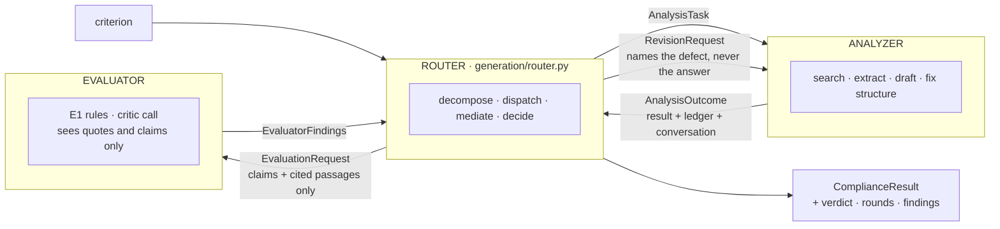

# The three agents

The compliance analysis is not one model call. It is three named agents with
one job each, and a typed protocol between them:

| Agent | File | Does | Model call? |
|---|---|---|---|
| **[Router](router.md)** | `generation/router.py` | Invokes the other two, decides what happens next, composes the confidence, runs the cross-criterion pass | **No** -- a state machine over structured messages |
| **[Analyzer](analyzer.md)** | `generation/agent.py`, `analysis.py`, `tools.py` | Searches the contract, extracts evidence, drafts a `ComplianceDraft`, corrects its own *structure* | Yes -- `analysis_model` |
| **[Evaluator](evaluator.md)** | `generation/evaluator.py` | Deterministic pre-checks, then judges whether each quote carries the claim it was cited for | Yes -- `evaluator_model` |

`report.py` is the **harness**, not a fourth agent: threads, a connection per
criterion, event serialisation, the analyses row. Keeping it out of the agent
count is deliberate. It is plumbing, and calling plumbing an agent is how
architecture diagrams start lying.



## The loop, per criterion

```
round = 0
outcome = Analyzer(criterion)
loop:
    findings = Evaluator(EvaluationRequest.of(outcome))   # rules, then critic
    decision = decide(findings, round)                    # deterministic
    if accept or fallback: return finalize(...)
    round += 1
    outcome = Analyzer.revise(outcome, RevisionRequest.of(findings))
```

Bounded by `router_max_rounds` (default 1). A criterion that never settles
still returns -- flagged, capped, with the findings attached. A stuck loop
never blocks the demo, which is the same principle the structural fix rounds
already followed.

## The protocol

All three run **in one process**, and the protocol is typed JSON via Pydantic
models passed as arguments and return values -- the same one-transport rule
the rest of the system keeps. No queue, no HTTP between agents, no framework.

| Message | From → To | Carries |
|---|---|---|
| `Criterion` (+ `RevisionRequest` on later rounds) | Router → Analyzer | what to assess, or what was wrong with the last attempt |
| `AnalysisOutcome` | Analyzer → Router | the result, the evidence ledger, the conversation, the live tools |
| `EvaluationRequest` | Router → Evaluator | the claims, **only the cited passages**, the tool-call queries, the round |
| `EvaluatorFindings` | Evaluator → Router | per-quote support, per-status agreement, state agreement, `missing_searches`, `critic_confidence` |
| `RouterDecision` | Router (internal, logged) | `accept` / `revise(mode)` / `fallback`, reason codes, round |

Serialising these is not ceremony. The `EvaluationRequest` JSON is *exactly*
what an out-of-process evaluator -- a second vendor, a batch re-scoring job --
would receive, so the seam is real before anything crosses it. It is also
literally what goes into the critic's prompt: `evaluator._render` dumps the
model to JSON and the request body contains that string.

## Why three, and not one loop with a self-check

The Analyzer cannot see its own errors. The specific failure it is
structurally blind to is a **verbatim quote that does not support the claim**:
"Supplier *may* rotate passwords" is copied exactly from the contract, passes
every rule in `validate.py`, and supports nothing. A second pass by the same
model over the same conversation makes the same mistake for the same reason --
it is re-reading its own reasoning.

So the critic is given the quotes, the passages and the claims, and nothing
else. It has to re-derive the support link from scratch. The Router exists
because *someone* has to own that: which evidence the critic sees, when to
stop, what a second opinion may cost. Making it an explicit component with
logged decisions is what makes the loop auditable rather than merely present.

## Why the Router is deterministic

Every input to `decide` is already a structured judgement produced by a model
or a rule. A model re-reading that JSON to choose `accept` over `revise` would
add latency, cost and a new failure mode while being un-unit-testable. The
policy is a table and `tests/test_router.py` pins it.

The intelligence sits at the ends -- retrieval routing inside the Analyzer's
tool loop, content judgement in the Evaluator -- where only a model can do the
work. If a finding class ever genuinely needs discretion ("is this hedge
material?"), the discretion belongs in the *Evaluator's rubric*, and the
Router goes on reading verdicts.

## Failure, and its one direction

| What fails | What happens |
|---|---|
| Transport (connection, timeout, 429, 5xx) | `http_client.RetryingTransport` retries with full-jitter exponential backoff. One retry loop in the process; no agent adds a second. |
| Critic answers unusably (truncation, refusal, unparseable, findings that fail the deterministic checks) | Two more attempts on the same backoff curve, then `EvaluationFailed` |
| `EvaluationFailed` reaches the Router | The criterion ships with `verdict="unevaluated"`, `needs_review=True`, confidence capped, and the analyst's own numbers |
| Rounds exhausted, findings still open | `verdict="fallback"`, same flags, findings attached |
| Analyzer never produces a draft | `AnalysisFailed` propagates; the harness records the criterion as failed, exactly as before |

**The Evaluator may only ever lower what ships. It must never be the reason
nothing ships.** That is the whole failure strategy in one sentence, and
`test_router.py::test_an_evaluator_that_cannot_answer_lowers_the_result_but_never_blocks_it`
is the one test that says it.

## What you can see in the log

Every span carries the run's trace id, so one `jq` filter reconstructs a
criterion end to end:

| Span | Carries |
|---|---|
| `router.criterion` | criterion, verdict, rounds, duration, evaluator cost, total cost |
| `analysis.criterion` | state, confidence, structure rounds, `ended_by` |
| `agent.run` / `agent.call` / `agent.tool` | the loop, each request, each search |
| `analysis.revise` | mode, round, extra tool calls granted and used |
| `evaluator.precheck` | hedged quotes found, unsearched sub-requirement ids |
| `evaluator.critic` | model, tokens, cost, disputed counts, support ratio, `critic_confidence` |

`router.decision` is a log line rather than a span (it wraps no work), and it
carries the verdict, the mode and every reason code.

Over SSE the same phases appear as `evaluating`, `revising` and `decision`
events, so a progress view shows the loop happening instead of a longer pause.

## Configuration

| Setting | Default | What it does |
|---|---|---|
| `evaluator_model` | `""` → `analysis_model` | The critic's model. Empty means the analyst's -- the check that matters is that the critic sees only quotes and claims, not that it is a different vendor. |
| `evaluator_effort` | `medium` | The critic reads a page and answers a schema. Reading, not deduction. |
| `evaluator_max_tokens` | `4000` | The findings are a bounded structure, but a judgement per (quote, sub-requirement) pair plus thinking outgrew 2000 on a live run -- and a truncation does not clear on retry the way load does. Half the analyst's budget. |
| `router_max_rounds` | `1` | Revision rounds after the first analysis. One demonstrates the mechanism; the KPI revise rate is what would justify raising it. |
| `research_extra_tool_calls` | `3` | Tool calls a `research` revision may add *on top of what was already spent*. A delta, never a fresh allowance. |

## What it costs

Per contract: five critic calls, each bounded by `evaluator_max_tokens`
(4000) -- about one extra analysis run in total -- plus one more finisher
call per criterion that gets revised,
bounded by `router_max_rounds`. Each criterion holds its worker slot slightly
longer, so wall clock moves from ~60 s toward ~75--90 s; the concurrency
ceiling (`api_workers × analysis_workers`) does not widen, because the critic
call happens inside the criterion's own slot.

`cost_usd` on each result includes its critic call, and
`evaluator_cost_usd` says how much of it that was.

## Deliberately not done

* **No framework.** The loop above is thirty lines of control flow and every
  hand-off is a span. A graph framework would add a second retry layer against
  the one-transport rule and hide the demo's log story.
* **Chat is untouched.** It keeps its own loop and budgets; evaluation is a
  compliance-analysis concern.
* **`validate.py` unchanged.** It answers "is this well-formed"; the Evaluator
  answers "is this right". The critic sits after the structural gate and never
  replaces it.
* **No cross-criterion critic call.** The fan-in pass is deterministic until
  it demonstrably misses something.

## See also

* [confidence.md](confidence.md) -- what the number means, and what it does not
* [../generation.md](../generation.md) -- the loop, the tools, the two finishers
* [../compliance.md](../compliance.md) -- the criteria, the schema, the validator
* `plan_implement_docs/AGENT_PLAN_01/` -- the design these files implement
