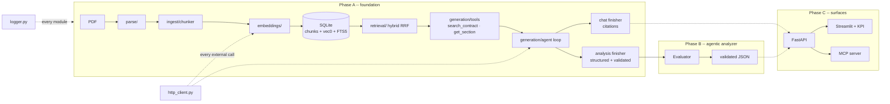

# Architecture

The master document. Each section links to a granular doc in this folder; the
plan and the implementation reports live in `plan_implement_docs/`. This file
is updated at every checkpoint, so its "Status" column is the honest state of
the repository, not the intended one.

## What the system does

Given a PDF contract, decide for each of five compliance requirements (password
management, IT asset management, training & background checks, data-in-transit
encryption, network authentication & authorization) whether the contract is
**Fully / Partially / Non-Compliant**, with a calibrated confidence, verbatim
quotes with section references, and a rationale -- and let a reviewer ask
free-form questions over the same contract with cited answers.

## Layers



Two modules cut across everything and were built first:

* **`logger.py`** -- the only logging surface. Structured JSON lines with
  `trace_id` / `span_id` / `parent_span_id` from context variables, plus a
  `span()` context manager that times any block. See [logging.md](logging.md).
* **`http_client.py`** -- the only way bytes leave the process. One `httpx2`
  transport with 3 retries on exponential backoff; the Anthropic and OpenAI
  SDKs are built on it with their own retries disabled. See
  [http-client.md](http-client.md).

## Module map and status

| Module | Purpose | Doc | Status |
|---|---|---|---|
| `logger.py` | JSON logging, trace/span context | [logging.md](logging.md) | done, tested |
| `http_client.py` | retrying transport for all external HTTP | [http-client.md](http-client.md) | done, tested |
| `config.py` | settings from `.env` (secrets, paths) and `settings.json` (tuning), anchored to the project root | [configuration.md](configuration.md) | done |
| `db.py`, `schema.sql` | SQLite + sqlite-vec + FTS5, one file | [storage.md](storage.md) | done |
| `tokens.py` | tiktoken counts with an offline fallback | [storage.md](storage.md#token-counting) | done |
| `models.py` | the `Chunk` record | [storage.md](storage.md#the-chunk-record) | done |
| `parse/` | PDF → typed elements (headings, paragraphs, tables, figures), clause-level, with a synthesized section spine for outline-less PDFs | [parsing.md](parsing.md) | done, tested on the sample contract |
| `ingest/` | elements → chunks → embeddings → rows | [chunking.md](chunking.md), [ingestion.md](ingestion.md) | done, tested on the sample contract |
| `embeddings/` | OpenAI / local / fake embedders | [ingestion.md](ingestion.md) | done, tested |
| `retrieval/` | vector KNN + BM25 fused with RRF, per document | [retrieval.md](retrieval.md) | done, tested on the sample contract |
| `generation/` | one tool-using agent loop; analysis finisher (structured, validated) and chat finisher (streamed, cited) | [generation.md](generation.md) | done, tested offline against the real SDK |
| `compliance/` | the five criteria with sub-requirements, the result schema, the structural validator | [compliance.md](compliance.md) | done, tested |
| `agents/` | router / extractor / evaluator state machine | -- | Phase B |
| `api/`, `ui/`, `mcp/` | surfaces | -- | Phase C |
| `Dockerfile`, `docker-compose.yml`, `docker/` | build and run the whole thing in a container | [docker.md](docker.md) | foundation laid; `api`/`ui` verbs await Phase C |

## Data flow, end to end (Phase A)

1. `parse_pdf(path)` reads the PDF once with PyMuPDF and emits an ordered list
   of `Element`s, each with its page, bounding box, and section breadcrumb.
   Tables become `TableElement`s carrying a markdown grid; figures become
   `FigureElement`s with an image on disk.
2. `chunk_document()` packs elements into chunks that never cross a section
   boundary, to a 400-token budget the breadcrumb is paid out of; tables are
   atomic chunks and every chunk's text opens with its breadcrumb (`6. Identity
   … > 6.6 Password Management Standard`), which is what makes an exhibit's
   requirement rows findable by the section that names them. 164 elements
   become 102 chunks. Overlap carries whole elements, falling back to a
   sentence tail — and never fires on this contract, because a section
   boundary always closes a chunk before the budget does.
3. `ingest_file()` hashes the file (unchanged files are skipped before
   parsing, so a second run costs zero embedder calls), embeds the chunks in
   batches, and writes `documents`, `chunks`, `chunks_vec` and `chunks_fts` in
   one transaction. `documents.spine_source` records whether the breadcrumbs
   came from the PDF's outline or were inferred.
4. `retrieve(question, …, document_id=…)` runs a KNN query and a BM25 query,
   fuses the two rankings with Reciprocal Rank Fusion, and reads the rows for
   the top chunks only. The KNN side is scoped by the `chunks_vec` partition
   key, so it is exact rather than a global search filtered afterwards, and
   `document_id` is required -- a forgotten scope would cite another contract
   in a well-formed citation. `retrieve_by_section()` is the structural way in
   ("give me Exhibit G"), no embedder involved.
5. The model retrieves **itself**, through `search_contract` and
   `get_section`, in a `while stop_reason == "tool_use"` loop bounded by a
   tool-call cap, an evidence-token cap and dedupe. Every chunk a tool
   returns lands in a per-run evidence ledger (`E1, E2, …`).
6. Two finishers, because `output_config.format` and citations cannot share
   a request (a 400). **Analysis** asks for a `ComplianceDraft` as structured
   output and validates it in pure Python against the ledger -- quotes
   verbatim, state derived from sub-requirement statuses, question copied --
   feeding the errors back up to two rounds, then dropping any quote that
   still fails and flagging `needs_review`. **Chat** sends the ledger as
   document blocks with citations enabled and streams the reply; the quotes
   come from the API, so they cannot be invented.

## Design decisions to be able to defend

| Decision | Why | Alternative rejected |
|---|---|---|
| Hand-written geometric parser on PyMuPDF | deterministic, <1 s per contract, every failure inspectable via `parse_report.py`; Word-generated contracts have real ruled tables and consistent fonts | Unstructured/Docling (heavier, opaque), LLM-OCR (slow, non-deterministic, costs per page) |
| Section-aware 400-token chunks with breadcrumb prefix | a clause is the unit of meaning; a citation should land on the obligation, not the section | fixed-size sliding windows (split obligations, no provenance) |
| SQLite + sqlite-vec + FTS5 | one file, zero infrastructure, hybrid retrieval is a JOIN; the interface hides the store so pgvector/Qdrant is a swap | a vector DB service for a 21-page document |
| Hybrid retrieval with RRF | compliance language mixes exact jargon ("TLS 1.2", "PASS-02", "SAML") that BM25 nails with paraphrase ("secure admin pathway" ≈ "bastion") that vectors catch | vector-only (misses identifiers), keyword-only (misses paraphrase) |
| The model retrieves through tools, not a fixed pipeline | the model writes the query, picks the mode and loops; every decision is a logged tool call with its arguments; `document_id` is bound in Python so scope cannot leak | a router call that plans queries once, executed by Python |
| Caps as counters, not prompts | `max_tool_calls`, `max_evidence_tokens`, dedupe; a capped run finishes with what it has and is marked `ended_by=cap` | trusting "stop when you have enough" |
| Two finishers | structured output and citations cannot share a request; analysis verifies its quotes deterministically, chat gets API-extracted quotes | one finisher that asks for JSON *with* `[1]` markers |
| Structural self-correction is deterministic | a validator lists what is malformed and the model fixes only that; no model judges structure | an LLM critic for JSON shape |
| Claude native citations for chat | the quote is produced by the API from the document block we sent; it cannot be hallucinated | asking the model to write `[1]` markers |
| One retrying transport, SDK retries off | a single, tested, logged policy; a retry storm cannot come from two layers | trusting each SDK's defaults |
| One logger with contextvars | every line under a request carries the same trace id without threading it through signatures | per-module `logging.getLogger` with ad-hoc formats |
| No LangChain / LangGraph | five fixed criteria and a deterministic loop; plain Python is easier to log, test with stubs, and explain | framework abstractions that hide the prompt and the retries |

## Repository layout

```
src/contract_analyzer/   the package (src layout; `pip install -e .`)
  logger.py http_client.py config.py db.py schema.sql models.py tokens.py
  parse/  ingest/  embeddings/  retrieval/  generation/  compliance/
scripts/                 CLIs (ingest, search, chat, parse_report)
tests/                   offline suite: fake embedder, scripted SSE API, mock transport
docker/                  entrypoint.sh (one verb per surface); Dockerfile at the root
docs/                    this folder -- one file per module plus this one
plan_implement_docs/     plans before, reports after, per phase
data/samples/            the sample contract; data/*.db and data/raw are gitignored
.run/                    app.jsonl (structured log), gitignored
```

## Environment

Python ≥ 3.11, `pip install -e ".[dev]"`. Keys in `.env` (see
`.env.example`): `ANTHROPIC_API_KEY` for answers, `OPENAI_API_KEY` for
embeddings. `embedding_provider: "fake"` in `settings.json` runs the whole
pipeline offline with hashed vectors for demos and tests. PyMuPDF is
AGPL-3.0 (see parsing.md).

Containers are an alternative to the virtualenv, not a replacement: `make
docker-build && make docker-test` builds the image and runs the same suite
inside it. See [docker.md](docker.md).

## Change log of this document

* Checkpoint 5 (2026-08-24): generation. One tool-using loop
  (`search_contract`, `get_section`, evidence ledger, three caps) serving two
  finishers: the compliance analysis as validated structured output with
  bounded self-correction and a first confidence design, and the chat with
  API-extracted citations streamed. `compliance/` gains sub-requirements, the
  result schema and the validator. 281 tests, all offline, the SDK driven by
  canned SSE. CLIs, API, evaluator and surfaces pending.
* Checkpoint 1 (2026-08-23): foundation scaffold, logger, HTTP client, settings,
  storage, parser copied. Section spine, chunker, embeddings, retrieval,
  generation pending.
* Checkpoint 4 (2026-08-23): retrieval. Two retrievers over the one database
  fused by RRF (`rrf_k=60`, ties broken on `chunk_id`), scoped to one contract
  by a `chunks_vec` partition key that filters before `k`; `keyword` mode runs
  with no embedder and no key. Citations carry the section, the printed page
  range and `spine_source`, and a table's text keeps its breadcrumb.
  `retrieve_by_section()` answers "give me 6.6" in SQL. 209 tests. Generation
  and the CLIs pending.
* Checkpoint 3 (2026-08-23): chunker, ingest pipeline and embedders. 164
  elements become 102 chunks, every one with a breadcrumb and none over
  budget; ingestion is idempotent (second run: zero embedder calls) and
  records `spine_source`; three embedder backends behind one protocol with a
  single retry policy in the transport. 161 tests. Retrieval, generation and
  the CLIs pending.
* Checkpoint 2 (2026-08-23): parser hardened against the sample contract --
  clause-level elements, synthesized section spine, hyphen resolution from
  measured evidence, page-spanning tables stitched, page spans on merged
  elements, measured furniture bands; 61 parser tests. Chunker onward pending.
