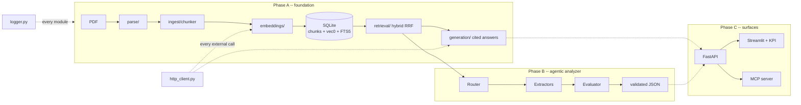

# Architecture

The master document. Each section links to a granular doc in this folder; the
plan and the implementation reports live in `plan_implement_docs/`. This file
is updated at every checkpoint, so its "Status" column is the honest state of
the repository, not the intended one.

## What the system does

Given a PDF contract, decide for each of five compliance requirements (password
management, IT asset management, training & background checks, data-in-transit
encryption, network authentication & authorization) whether the contract is
**Fully / Partially / Non-Compliant**, with a calibrated confidence, verbatim
quotes with section references, and a rationale -- and let a reviewer ask
free-form questions over the same contract with cited answers.

## Layers



Two modules cut across everything and were built first:

* **`logger.py`** -- the only logging surface. Structured JSON lines with
  `trace_id` / `span_id` / `parent_span_id` from context variables, plus a
  `span()` context manager that times any block. See [logging.md](logging.md).
* **`http_client.py`** -- the only way bytes leave the process. One `httpx2`
  transport with 3 retries on exponential backoff; the Anthropic and OpenAI
  SDKs are built on it with their own retries disabled. See
  [http-client.md](http-client.md).

## Module map and status

| Module | Purpose | Doc | Status |
|---|---|---|---|
| `logger.py` | JSON logging, trace/span context | [logging.md](logging.md) | done, tested |
| `http_client.py` | retrying transport for all external HTTP | [http-client.md](http-client.md) | done, tested |
| `config.py` | settings from `.env`, anchored to the project root | [configuration.md](configuration.md) | done |
| `db.py`, `schema.sql` | SQLite + sqlite-vec + FTS5, one file | [storage.md](storage.md) | done |
| `tokens.py` | tiktoken counts with an offline fallback | [storage.md](storage.md#token-counting) | done |
| `models.py` | the `Chunk` record | [storage.md](storage.md#the-chunk-record) | done |
| `parse/` | PDF → typed elements (headings, paragraphs, tables, figures) | [parsing.md](parsing.md) | copied; section spine for outline-less PDFs pending |
| `ingest/` | elements → chunks → embeddings → rows | chunking.md, ingestion.md | pending |
| `embeddings/` | OpenAI / local / fake embedders | ingestion.md | pending |
| `retrieval/` | vector KNN + BM25 fused with RRF, per document | retrieval.md | pending |
| `generation/` | cited conversational answers (Claude citations) | generation.md | pending |
| `compliance/` | the five criteria and the result schema | -- | criteria file only |
| `agents/` | router / extractor / evaluator state machine | -- | Phase B |
| `api/`, `ui/`, `mcp/` | surfaces | -- | Phase C |
| `Dockerfile`, `docker-compose.yml`, `docker/` | build and run the whole thing in a container | [docker.md](docker.md) | foundation laid; `api`/`ui` verbs await Phase C |

## Data flow, end to end (Phase A)

1. `parse_pdf(path)` reads the PDF once with PyMuPDF and emits an ordered list
   of `Element`s, each with its page, bounding box, and section breadcrumb.
   Tables become `TableElement`s carrying a markdown grid; figures become
   `FigureElement`s with an image on disk.
2. `chunk_document()` packs elements into ~400-token chunks that never cross a
   section boundary, with whole-element overlap; tables are atomic chunks.
   Every chunk's text opens with its breadcrumb (`6. Identity … > 6.6 Password
   Management Standard`).
3. `ingest_file()` hashes the file (unchanged files are skipped before
   parsing), embeds the chunks in batches, and writes `documents`, `chunks`,
   `chunks_vec` and `chunks_fts` in one transaction.
4. `retrieve(question, document_id=…)` runs a KNN query and a BM25 query, fuses
   the two rankings with Reciprocal Rank Fusion, and hydrates the top chunks.
5. `answer()` sends the chunks as Claude *document blocks* with citations
   enabled and streams the reply; citations are resolved back to chunk ids and
   pages. Quotes come from the API feature, so they cannot be invented.

## Design decisions to be able to defend

| Decision | Why | Alternative rejected |
|---|---|---|
| Hand-written geometric parser on PyMuPDF | deterministic, <1 s per contract, every failure inspectable via `parse_report.py`; Word-generated contracts have real ruled tables and consistent fonts | Unstructured/Docling (heavier, opaque), LLM-OCR (slow, non-deterministic, costs per page) |
| Section-aware 400-token chunks with breadcrumb prefix | a clause is the unit of meaning; a citation should land on the obligation, not the section | fixed-size sliding windows (split obligations, no provenance) |
| SQLite + sqlite-vec + FTS5 | one file, zero infrastructure, hybrid retrieval is a JOIN; the interface hides the store so pgvector/Qdrant is a swap | a vector DB service for a 21-page document |
| Hybrid retrieval with RRF | compliance language mixes exact jargon ("TLS 1.2", "PASS-02", "SAML") that BM25 nails with paraphrase ("secure admin pathway" ≈ "bastion") that vectors catch | vector-only (misses identifiers), keyword-only (misses paraphrase) |
| Claude native citations for chat | the quote is produced by the API from the document block we sent; it cannot be hallucinated | asking the model to write `[1]` markers |
| One retrying transport, SDK retries off | a single, tested, logged policy; a retry storm cannot come from two layers | trusting each SDK's defaults |
| One logger with contextvars | every line under a request carries the same trace id without threading it through signatures | per-module `logging.getLogger` with ad-hoc formats |
| No LangChain / LangGraph | five fixed criteria and a deterministic loop; plain Python is easier to log, test with stubs, and explain | framework abstractions that hide the prompt and the retries |

## Repository layout

```
src/contract_analyzer/   the package (src layout; `pip install -e .`)
  logger.py http_client.py config.py db.py schema.sql models.py tokens.py
  parse/  ingest/  embeddings/  retrieval/  generation/  compliance/
scripts/                 CLIs (ingest, search, chat, parse_report)
tests/                   offline suite: fake embedder, stub LLM client, mock transport
docker/                  entrypoint.sh (one verb per surface); Dockerfile at the root
docs/                    this folder -- one file per module plus this one
plan_implement_docs/     plans before, reports after, per phase
data/samples/            the sample contract; data/*.db and data/raw are gitignored
.run/                    app.jsonl (structured log), gitignored
```

## Environment

Python ≥ 3.11, `pip install -e ".[dev]"`. Keys in `.env` (see
`.env.example`): `ANTHROPIC_API_KEY` for answers, `OPENAI_API_KEY` for
embeddings. `EMBEDDING_PROVIDER=fake` runs the whole pipeline offline with
hashed vectors for demos and tests. PyMuPDF is AGPL-3.0 (see parsing.md).

Containers are an alternative to the virtualenv, not a replacement: `make
docker-build && make docker-test` builds the image and runs the same suite
inside it. See [docker.md](docker.md).

## Change log of this document

* Checkpoint 1 (2026-08-23): foundation scaffold, logger, HTTP client, settings,
  storage, parser copied. Section spine, chunker, embeddings, retrieval,
  generation pending.
