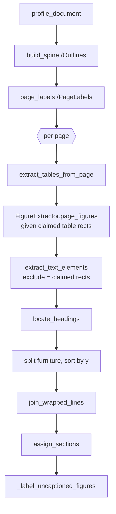

# PDF parsing

What `src/contract_analyzer/parse/` does, why it is built the way it is, and
the contract it hands to the chunker. The numbers quoted throughout were
measured on the sample contract in `assignment_details/Sample Contract.pdf`
(a 21-page "Information Security and Technology Risk Addendum", produced by
Word's PDF export).

## Purpose

A PDF is a display list, not a document. It records where to paint glyphs on a
page; it does not record word boundaries, paragraphs, reading order, or the
fact that a particular grid of positioned strings is a table. Every extractor
is therefore a set of geometric heuristics over a bag of glyphs, and the
heuristics are what separate one extractor from another.

For compliance analysis the unit that matters is the clause: "6.6 Password
Management Standard" has to arrive as one paragraph, the "Data Category |
Included? | Examples | Special Handling" matrix on page 2 has to arrive as one
table with its columns intact, and every finding has to cite the page a reader
will actually open. `parse_pdf()` returns an ordered list of typed
**elements** rather than one string plus a page map, so downstream code packs
meaning-bearing units instead of slicing a wall of text.

```python
from contract_analyzer.parse import parse_pdf

parsed = parse_pdf("assignment_details/Sample Contract.pdf", assets_dir="data/assets")
for element in parsed.elements:
    element.type          # heading | paragraph | table | figure | caption | equation
    element.page_index    # 0-based physical page -- for opening the file
    element.page_label    # printed page number -- for display
    element.section_path  # breadcrumb, once a section spine exists (see Known limitations)
```

## Why PyMuPDF and a hand-written geometric parser

The alternatives considered were Unstructured, Docling, and sending page images
to a vision model for OCR-style extraction. The parser is written by hand on
top of PyMuPDF for three reasons that matter in a compliance setting:

- **Deterministic.** The same file produces the same elements every run.
  A compliance finding that cites "p.7, clause 9.3" must be reproducible; a
  layout model with sampling in it, or an LLM asked to transcribe a page, is
  not.
- **Fast.** A 21-page contract parses in well under a second. Unstructured
  and Docling load layout-detection models that take longer than that to
  start; LLM-OCR is a network round-trip per page and costs money.
- **Inspectable.** Every decision is a named threshold in the code
  (`HEADING_SIZE_MARGIN`, `MIN_FILL_RATE`, `_FOOTER_BAND`), and every dropped
  block is kept in `ParsedDocument.furniture` rather than discarded. When the
  parser gets something wrong, the reason is a number you can read, not a
  weight inside a model.

PyMuPDF was chosen over pdfplumber + pypdf because it supplies the outline,
page labels, table detection (`find_tables`), image extraction and page
rendering from one API. The licence cost of that choice is discussed at the
end.

## The element model

Three dataclasses in `elements.py`, all `kw_only=True`. `Element` is the base;
the subclasses override `type` with a default, which is why keyword-only
construction is required.

```python
@dataclass(kw_only=True)
class Element:
    type: ElementType        # heading|paragraph|table|figure|caption|equation|furniture
    text: str                # what gets embedded and shown; never empty
    page_index: int          # 0-based physical page -- for opening the file
    page_label: str          # printed page ("7") -- for display
    bbox: BBox               # x0, y0, x1, y1 on the page
    section: str = ""        # filled by assign_sections()
    section_path: list[str]  # filled by assign_sections()
    order: int = -1          # filled by assign_sections()
```

`__post_init__` raises `ValueError` on empty text: an element with nothing to
show is an extraction bug, and catching it at construction beats discovering
it as a blank citation in a compliance report. `breadcrumb` renders
`section_path` as `"6. Identity ... > 6.6 Password Management Standard"`.

`TableElement` adds `markdown`, `rows`, `caption`, `caption_bbox`, and
`quality: TableQuality` (`"ruled" | "recovered" | "text-fallback"`), with
computed `n_rows` / `n_cols`. `FigureElement` adds `asset_paths` (a list, for
multi-panel figures), `caption`, `caption_bbox`, `width`, `height`, and an
optional `description`.

**`page_index` vs `page_label`.** The index is what you pass to a viewer to
open the file; the label is the number printed on the page, read from
`/PageLabels`. Reports with roman-numbered front matter can differ by a dozen
pages between the two. The sample contract carries no `/PageLabels`, so
`page_labels()` falls back to the 1-based index and the two coincide; the
field exists so the distinction survives when a contract *does* carry them.

The `furniture` type (page numbers, running headers) is produced by the
classifier and then split out into `ParsedDocument.furniture`, not into the
void.

## The pipeline in run order

`parse_pdf(path, *, assets_dir=None, extract_figures=True, extract_tables=True)
-> ParsedDocument` in `pdf.py` owns the pass order, and the order is
load-bearing: each step depends on something the previous one established.



**Document-wide passes, before any page is read.**

1. `profile_document(doc) -> DocumentProfile` measures what a single page
   cannot know about itself: the modal `body_size` (character-weighted, so a
   three-word heading cannot outvote a paragraph), the text column's
   `body_left` / `body_right`, the document's own vocabulary in `hyphenated`
   and `words`, and `furniture_patterns` (digit-masked texts that recur in the
   header/footer bands on at least `_REPEAT_SHARE = 0.20` of pages and
   `_REPEAT_MIN_PAGES = 3`).
2. `build_spine(doc) -> list[Section]` flattens `/Outlines` into document
   order with ancestry resolved, converting PyMuPDF's 1-based `get_toc()`
   pages to the 0-based indices used everywhere else.
3. `page_labels(doc) -> list[str]` reads the printed label per page.

**Per-page passes, in this exact order.** The ordering is what prevents
double-indexing: text inside a table region is the most likely thing to be
misread as prose, so tables claim their rectangles first, figures are handed
those rectangles so an image inside a table is not extracted twice, and text
extraction runs last with `exclude=claimed`. `_claimed_by()` compares block
*centres* against claimed rects rather than requiring containment, because an
extracted table's bbox is usually a point or two tighter than the text it
holds. Caption blocks are claimed too (`_caption_rects`), since the caption
text is already inside the table or figure element.

`locate_headings(spine, page_index, elements)` then pins each outline entry to
the y-position of its rendered heading, so a section starts where its title
does rather than at the top of the page. Finally furniture is split out and
tables, figures and text are sorted together by `(round(y0 / 3), x0)` so
reading order survives.

**Post passes.** `join_wrapped_lines(elements, profile)` rebuilds paragraphs
from the lines PyMuPDF hands out as separate blocks (the merged element keeps
the first line's page, which is where a citation should point).
`assign_sections(elements, spine)` walks elements and spine with a single
advancing cursor and fills `section`, `section_path` and `order`.
`_label_uncaptioned_figures` gives a figure with no caption the text
`"Figure in {section} (page {label})"`.

## The four inference layers

Everything in `blocks.py` is a heuristic over geometry and font metadata.

**Profile.** Every later judgement is relative: "larger than the body" needs
to know what body is. `body_left` is measured only over blocks that reach
`body_right`, because sampling every block's left edge counts indented first
lines and hanging indents as the margin.

**Classify.** `classify(block, profile, page_height) -> str` runs in a fixed
order, furniture first so a page number is never mistaken for a one-word
heading:

```
furniture  -> in the header/footer band AND (a bare number OR a known furniture pattern)
caption    -> CAPTION_RE matches at the start ("Figure 2.1:", "Table A.3.")
equation   -> >= 40% of characters set in a font matching _MATH_FONT
heading    -> dominant span size > body_size + HEADING_SIZE_MARGIN (0.5pt), not italic
paragraph  -> everything else
```

The dominant span is the `(font, size, flags)` covering the most characters
in the block, so a stray footnote marker does not decide a block's class.

**Furniture.** The bands are `_HEADER_BAND = 0.06` and `_FOOTER_BAND = 0.85`
of page height. A block in a band is furniture if it is a bare arabic or roman
number, or if its digit-masked text (`"Page # of #"`) is in
`profile.furniture_patterns`. On the sample contract this dropped 0 blocks --
either the addendum carries no running header or page number, or they sit in
a block that also holds body text; `scripts/parse_report.py` will show which
once it is ported (step 13 of the plan).

**Headings.** The size rule finds every numbered section heading in the
sample contract, because Word sets them larger than the body. It deliberately
does *not* find sub-clauses such as "6.6 Password Management Standard." Those
are bold inline runs at the start of an ordinary paragraph, at the body's own
size; treating every bold run as a heading would also promote defined terms
and emphasis. When an outline exists, `locate_headings` promotes such blocks
by exact title match instead. Without an outline they stay paragraphs, which
is the gap discussed under Known limitations.

Two supporting passes belong here. `join_lines(lines, profile)` resolves a
line-end hyphen from the document's own vocabulary: the compound wins if it is
attested hyphenated elsewhere (`third-party`, `sub-processor`), otherwise the
merged word wins if attested, otherwise the hyphen is dropped. And
`_continues(prev, element, profile)` in `pdf.py` is the paragraph-reassembly
test: the previous line reaches the right margin, starts within `_INDENT` of
the left one, the next line starts flush left, neither is a dot-leader contents
row, the combined length is under `_MAX_PARAGRAPH_CHARS = 4000`, and the
vertical gap is at most `_MAX_LINE_GAP` (a page break counts as a line break).

## The table ladder

`extract_tables_from_page(page, page_label, profile=None) -> list[TableElement]`
in `tables.py` is the only place that returns elements whose trustworthiness
varies, so each table records the rung it landed on.

| Rung | Method | Quality |
|---|---|---|
| 1 | `page.find_tables(strategy="lines")` | `ruled` |
| 2 | `recovery_clip()`: horizontal span from the page's rules, bottom from the run of blocks inside that span, then `find_tables(clip=..., strategy="text")` | `recovered` |
| 2b | `caption_band()`: for a table with no rules at all, the run of blocks below a `Table N:` caption that do not reach the right margin | `recovered` |
| 3 | `validate(rows)` | gate |
| 4 | `_region_text()` verbatim in a fenced block | `text-fallback` |

Rungs 2 to 4 only fire when a caption promises a table that rung 1 did not
find. `compact()` runs before validation, dropping wholly empty rows and
columns, because `strategy="text"` emits one row per visual line and a
multi-line cell arrives interleaved with blanks.

Rung 3 is the load-bearing step. `validate` requires `MIN_ROWS = 2`,
`MIN_COLS = 2`, uniform row width, and a cell fill rate of at least
`MIN_FILL_RATE = 0.6`. A mangled grid stored as data is worse than no table:
a reviewer can still read values out of a fenced block, but nobody can spot a
silently misaligned "Included?" column. Rung 1 candidates that fail validation
are skipped entirely rather than stored.

Word-produced contracts are the easy case. Word draws every cell border as a
real line, so the sample contract's 42 tables all land on rung 1: the 11x2
"Field | Value" service description on page 1, the 9x4 "Data Category |
Included? | Examples | Special Handling" matrix on page 2, and the control
matrices in Exhibits A onward. None of them carry a "Table N:" caption, so
`caption` is empty and the element's `text` is the markdown grid alone. The
chunker should prefix the enclosing section title for the same reason a
caption is prefixed when one exists: a bare grid embeds poorly.

`rows_to_markdown` renders the grid after compaction, escaping `|` and turning
in-cell newlines into `<br>`.

## Figures

`FigureExtractor` in `figures.py` is a per-document object because it holds
the SHA-256 de-duplication map: a logo repeated on every page is written
once. `page_figures(page, page_label, claimed)` extracts each image XObject at
native resolution, rejects anything under `MIN_PIXELS = 100` on a side or
below `MIN_PAGE_AREA_SHARE = 0.01` of the page, skips rects intersecting
claimed table regions, writes to `assets_dir/<slug>/p{page:03d}_{xref}.{ext}`,
pairs a caption via `pair_caption()` (figures prefer the caption below,
tables the one above), and groups panels that share a caption and sit within
`PANEL_GAP = 90.0` points. A `Figure N:` caption with no raster to pair with
means the artwork was drawn as vector paths; `_render_vector()` unions the
page's non-hairline drawing rects above the caption and rasterises at
`VECTOR_RENDER_DPI = 150`.

The sample contract has no figures. Contracts that do (a data-flow diagram, a
network architecture exhibit) are handled by the same path.

A figure is not text and the embedder only understands text, so what is
indexed is the caption. `describe.py` is an **opt-in** post-pass:
`describe_figures(figures, *, settings=None, model=None, overwrite=False) ->
int` sends each figure (downscaled to `MAX_LONG_EDGE = 1568`, at most
`MAX_PANELS = 4`) with its caption and breadcrumb to Claude and stores two or
three sentences in `FigureElement.description`. The client is built with
`http_client=get_http_client(settings)` and `max_retries=0`, so the request
goes through the repository's shared retrying HTTP client
(`http_client.py`) and there is exactly one retry policy for every external
call. It raises `DescriptionUnavailable` when there is no API key or the
`anthropic` package is missing, and a failure on one figure is logged and
skipped rather than aborting the parse. It is off by default because it costs
money and needs a network, and the parser must stay runnable offline.

## What the parser guarantees to the chunker

1. `elements` is in reading order; `order` is `0..n-1`; pages never decrease.
2. Every element has non-empty `text` (enforced at construction).
3. `page_label` is the number a reader will see on the page, or the 1-based
   index when the PDF carries no labels.
4. No table or figure region also survives as prose.
5. No caption is indexed twice.
6. Every table records its `quality`; a stored grid has passed `validate`.
7. Every figure has at least one asset on disk that opens as an image.
8. Furniture is out of `elements` and available in `furniture`.
9. A `paragraph` element is a paragraph, not a rendered line: wrapped lines
   are rejoined across page breaks with no text lost or duplicated.

`ParsedDocument` also carries `content_hash` (SHA-256 of the file, so
re-ingesting an unchanged contract is a no-op), `page_count`, `producer`,
`has_outline`, `sections`, and the `profile`.

## Measured on the sample contract

`parse_pdf("assignment_details/Sample Contract.pdf")` on the 21-page addendum:

| Measurement | Value |
|---|---|
| `/Outlines` | none (`has_outline = False`, `sections = []`) |
| `/PageLabels` | none; labels fall back to `"1"`..`"21"` |
| Headings | 51: "1. Order of Precedence" through "21. Term; Survival", then "Exhibit A — Control Matrix" through "Exhibit G" |
| Paragraphs | 52 |
| Tables | 42, all `ruled` (e.g. p.1 "Field \| Value" 11x2; p.2 "Data Category \| Included? \| Examples \| Special Handling" 9x4) |
| Figures | 0 |
| Furniture dropped | 0 |
| Sub-clauses ("6.6 Password Management Standard.") | bold inline runs at paragraph start, classified as `paragraph` |

The heading count is what the size rule alone recovers; the sub-clauses are
the part it cannot.

## Known limitations

- **`section` is blank on every element.** The sample contract has no
  `/Outlines`, so `build_spine` returns an empty list, `assign_sections` has
  nothing to assign, and `section` / `section_path` are empty on all 145
  content elements. This is the most important gap in the current parse and
  the next commit fixes it: `outline.synthesize_spine(elements)` will build
  the spine from the detected heading elements (`^\d{1,2}\.\s`,
  `^Exhibit [A-Z]`) and from bold sub-clause prefixes on paragraphs
  (`^\d{1,2}\.\d{1,2}\s+Title.`, `^G\d+[A-Z]?\.\s`), and
  `ParsedDocument.spine_source` will record `"outline" | "headings" | "none"`.
  See `plan_implement_docs/01_foundation_plan.md`, commit 6.
- **Tables spanning a page break** are extracted as two tables. Contract
  control matrices do this often; stitching by matching header rows is
  future work.
- **Tables carry no caption** in Word-produced contracts, so `TableElement.text`
  is the bare grid. The chunker must supply context from the section spine.
- **Multi-column reflow, OCR and formula recognition** are out of scope. The
  parser assumes a single column and a real text layer; a scanned contract
  will produce nothing.
- **Constants tuned on LaTeX theses.** The parser was developed on two
  double-spaced academic theses and several thresholds encode that origin.
  They work on the sample contract but should be re-measured on a wider set
  of Word-produced documents:
  - `_INDENT = 24.0` in `pdf.py` assumes LaTeX's 18pt `\parindent`; Word
    paragraphs are usually unindented with space-after instead.
  - `_MAX_LINE_GAP = 36.0` in `pdf.py` was set from 32pt double-spaced
    leading; single-spaced contracts sit well inside it, but a numbered list
    with generous spacing might not.
  - The booktabs recovery rung (`recovery_clip`, `_MIN_CLIP_HEIGHT = 60.0`,
    `_RULE_MIN_WIDTH = 100.0`) targets LaTeX tables with top and mid rules
    only; Word tables are fully ruled and never reach it.
  - `CAPTION_RE` expects `Figure 2.1:` / `Table A.3.` numbering. Contract
    exhibits caption tables as "Exhibit A — Control Matrix" or "Schedule 1",
    which it does not match.
  - `_MATH_FONT` matches Computer Modern and STIX math fonts and will never
    fire on a contract; the `equation` type is effectively unused here.

## Dependency note: PyMuPDF is AGPL-3.0

PyMuPDF is licensed AGPL-3.0 (or under a commercial Artifex licence). The
AGPL's network clause is triggered by distributing or serving the software;
a local analysis tool run on the user's own machine does neither, so this
repository can keep its own licence while depending on it. If the analyzer
were ever offered as a hosted service, the whole service would have to be
released under the AGPL or PyMuPDF would have to be replaced or commercially
licensed. The MIT-licensed alternative, pdfplumber + pypdf, loses the
page-label API and has noticeably weaker table extraction, which for a tool
whose inputs are mostly tables is the wrong trade.
