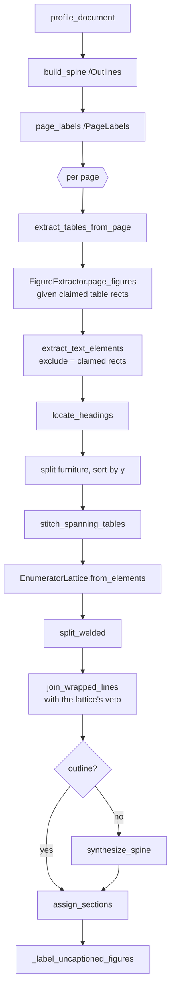

# PDF parsing

What `src/contract_analyzer/parse/` does, why it is built the way it is, and
the contract it hands to the chunker. The numbers quoted throughout were
measured on the sample contract in `data/samples/Sample Contract.pdf`
(a 21-page "Information Security and Technology Risk Addendum", produced by
Word's PDF export) and are asserted by `tests/test_parse_elements.py` and
`tests/test_parse_tables.py`.

## Purpose

A PDF is a display list, not a document. It records where to paint glyphs on a
page; it does not record word boundaries, paragraphs, reading order, or the
fact that a particular grid of positioned strings is a table. Every extractor
is therefore a set of geometric heuristics over a bag of glyphs, and the
heuristics are what separate one extractor from another.

For compliance analysis the unit that matters is the clause: "6.6 Password
Management Standard" has to arrive as one paragraph with the breadcrumb that
says where it sits, the "Data Category | Included? | Examples | Special
Handling" matrix on page 2 has to arrive as one table with its columns intact
and its identifiers unbroken, and every finding has to cite the page a reader
will actually open. `parse_pdf()` returns an ordered list of typed
**elements** rather than one string plus a page map, so downstream code packs
meaning-bearing units instead of slicing a wall of text.

```python
from contract_analyzer.parse import parse_pdf

parsed = parse_pdf("data/samples/Sample Contract.pdf")
parsed.spine_source        # "outline" | "headings" | "none"
for element in parsed.elements:
    element.type           # heading | paragraph | table | figure | caption | equation
    element.page_index     # 0-based physical page -- for opening the file
    element.page_label     # printed page number -- for display
    element.page_span      # (first, last) physical page; equal unless it crosses a break
    element.section_path   # ["6. Identity, ...", "6.6 Password Management Standard"]
```

## The rule every heuristic is held to

> **A decision may only use evidence the document supplies about itself.**

The parser measures the document first -- body font size, text column,
vocabulary, paragraph indent, hyphenation habit, text area -- and judges
every block relative to those measurements. Where a measurement is not
available the signal is structural (numbering that forms a coherent sequence)
or lexical (a token attested in this document's own text). No threshold is a
literal chosen because it happened to suit one file. Two corollaries recur:

* **Corroboration over pattern-matching.** A regex says a string *looks like*
  a clause number; whether it *is* one is decided by whether it takes its
  place in a sequence with its siblings.
* **Degrade, don't guess.** When the evidence is absent, record that it is
  absent (`spine_source = "none"`) and leave the field empty. A wrong section
  on a compliance citation is worse than a blank one.

`plan_implement_docs/02_parser_hardening_plan.md` records the audit that led
to this rule, the measurements behind each fix, and the shortcuts rejected
because they would have overfitted the sample.

## Why PyMuPDF and a hand-written geometric parser

The alternatives considered were Unstructured, Docling, and sending page images
to a vision model for OCR-style extraction. The parser is written by hand on
top of PyMuPDF for three reasons that matter in a compliance setting:

- **Deterministic.** The same file produces the same elements every run.
  A compliance finding that cites "p.7, clause 9.3" must be reproducible; a
  layout model with sampling in it, or an LLM asked to transcribe a page, is
  not.
- **Fast.** A 21-page contract parses in 0.9 s. Unstructured and Docling load
  layout-detection models that take longer than that to start; LLM-OCR is a
  network round-trip per page and costs money.
- **Inspectable.** Every decision is a named measurement on the
  `DocumentProfile` or a named rule in the code, and every dropped block is
  kept in `ParsedDocument.furniture` rather than discarded. When the parser
  gets something wrong, the reason is a number you can read, not a weight
  inside a model.

PyMuPDF was chosen over pdfplumber + pypdf because it supplies the outline,
page labels, table detection (`find_tables`), image extraction and page
rendering from one API. The licence cost of that choice is discussed at the
end.

## The element model

Three dataclasses in `elements.py`, all `kw_only=True`. `Element` is the base;
the subclasses override `type` with a default, which is why keyword-only
construction is required.

```python
@dataclass(kw_only=True)
class Element:
    type: ElementType        # heading|paragraph|table|figure|caption|equation|furniture
    text: str                # what gets embedded and shown; never empty
    page_index: int          # 0-based physical page where the element starts
    page_label: str          # printed page ("7") -- for display
    bbox: BBox               # x0, y0, x1, y1 on the page it starts on
    page_end: int | None     # last physical page it touches, if not page_index
    page_label_end: str
    section: str = ""        # filled by assign_sections()
    section_path: list[str]  # filled by assign_sections()
    order: int = -1          # filled by assign_sections()
```

`__post_init__` raises `ValueError` on empty text: an element with nothing to
show is an extraction bug, and catching it at construction beats discovering
it as a blank citation in a compliance report. `breadcrumb` renders
`section_path` as `"6. Identity ... > 6.6 Password Management Standard"`;
`page_span` returns `(page_index, page_end or page_index)`.

`TableElement` adds `markdown`, `rows`, `caption`, `caption_bbox`, and
`quality: TableQuality` (`"ruled" | "recovered" | "text-fallback"`), with
computed `n_rows` / `n_cols`. `FigureElement` adds `asset_paths` (a list, for
multi-panel figures), `caption`, `caption_bbox`, `width`, `height`, and an
optional `description`.

**`page_index` vs `page_label`.** The index is what you pass to a viewer to
open the file; the label is the number printed on the page, read from
`/PageLabels`. Reports with roman-numbered front matter can differ by a dozen
pages between the two. The sample contract carries no `/PageLabels`, so
`page_labels()` falls back to the 1-based index and the two coincide; the
field exists so the distinction survives when a contract *does* carry them.

**`page_index` vs `page_end`.** An element that was rejoined or stitched
across a page break starts on one page and ends on another. `page_index` keeps
meaning "where it starts", so nothing that only knows one page breaks, and a
citation that knows both renders `p.4-5` instead of sending the reviewer to
a page the quoted obligation is not on. `Chunk` carries the same pair.

The `furniture` type (page numbers, running headers) is produced by the
classifier and then split out into `ParsedDocument.furniture`, not into the
void.

## The pipeline in run order

`parse_pdf(path, *, assets_dir=None, extract_figures=True, extract_tables=True)
-> ParsedDocument` in `pdf.py` owns the pass order, and the order is
load-bearing: each step depends on something the previous one established.



**Document-wide passes, before any page is read.**

1. `profile_document(doc) -> DocumentProfile` measures what a single page
   cannot know about itself:
   * `body_size`, the modal font size, character-weighted so a three-word
     heading cannot outvote a paragraph;
   * `body_left` / `body_right`, the text column, measured over blocks that
     reach the right margin;
   * `paragraph_indent`, the first-line indent if the document has one:
     the second mode of the left-edge distribution of full-width blocks,
     accepted only if it holds at least 10 % of them. Word does not indent,
     so it is `0.0` on the sample; LaTeX's `\parindent` shows up as 18.
   * `hyphenated` and `words`, the document's own vocabulary, digits
     included so `PASS-02` and `27001` are attested like any word;
   * `breaks_hyphenate`, whether the document hyphenates at line ends,
     inferred from its own line-final hyphens (see *Line joining*);
   * `header_band` / `footer_band`, where the body text starts and stops as
     fractions of page height, from the extremes of full-width multi-line
     blocks -- 0.046 and 0.952 on the sample, whose text runs far past the
     0.85 a fixed constant would have assumed;
   * `furniture_patterns`, digit-masked texts that recur in those bands on
     at least `_REPEAT_SHARE = 0.20` of pages and `_REPEAT_MIN_PAGES = 3`.
2. `build_spine(doc) -> list[Section]` flattens `/Outlines` into document
   order with ancestry resolved, converting PyMuPDF's 1-based `get_toc()`
   pages to the 0-based indices used everywhere else.
3. `page_labels(doc) -> list[str]` reads the printed label per page.

**Per-page passes, in this exact order.** The ordering is what prevents
double-indexing: text inside a table region is the most likely thing to be
misread as prose, so tables claim their rectangles first, figures are handed
those rectangles so an image inside a table is not extracted twice, and text
extraction runs last with `exclude=claimed`. `_claimed_by()` compares block
*centres* against claimed rects rather than requiring containment, because an
extracted table's bbox is usually a point or two tighter than the text it
holds. Caption blocks are claimed too (`_caption_rects`), since the caption
text is already inside the table or figure element.

`locate_headings(spine, page_index, elements)` then pins each outline entry to
the y-position of its rendered heading, so a section starts where its title
does rather than at the top of the page. Finally furniture is split out and
tables, figures and text are sorted together by `(round(y0 / 3), x0)` so
reading order survives.

**Post passes, in this order.**

1. `stitch_spanning_tables` rejoins a table that a page break split (see
   *The table ladder*).
2. `EnumeratorLattice.from_elements` finds every clause label in the stream
   and corroborates it by sequence (see *Clause structure*).
3. `split_welded` cuts any paragraph that holds two corroborated clauses.
4. `join_wrapped_lines` rebuilds paragraphs from the lines PyMuPDF hands out
   as separate blocks, never across a corroborated clause boundary. The
   merged element keeps the first line's page as its anchor and records the
   last in `page_end`.
5. If the PDF had no outline, `synthesize_spine` builds one from the
   headings and the lattice, and `spine_source` becomes `"headings"`.
6. `assign_sections` walks elements and spine with a single advancing cursor
   and fills `section`, `section_path` and `order`.
7. `_label_uncaptioned_figures` gives a figure with no caption the text
   `"Figure in {section} (page {label})"`.

## The inference layers

Everything in `blocks.py` is a heuristic over geometry and font metadata.

**Classify.** `classify(block, profile, page_height) -> str` runs in a fixed
order, furniture first so a page number is never mistaken for a one-word
heading:

```
furniture  -> in a margin band AND (a page number OR a known furniture pattern)
caption    -> CAPTION_RE matches at the start ("Figure 2.1:", "Table A.3.")
equation   -> >= 40% of characters set in a font matching _MATH_FONT
heading    -> dominant span size > body_size + HEADING_SIZE_MARGIN (0.5pt), not italic
paragraph  -> everything else
```

The dominant span is the `(font, size, flags)` covering the most characters
in the block, so a stray footnote marker does not decide a block's class.

**Furniture.** A block is in a margin band when it starts above
`profile.header_band` or below `profile.footer_band`. It is furniture if
`is_page_number()` accepts its whole text -- arabic digits, or a roman
numeral that actually parses, so `LLC`, `civil` and `did` are not page
numbers -- or if its digit-masked text (`"Page # of #"`) is in
`profile.furniture_patterns`. The sample contract carries no running header
and no page number at all, which is why `furniture` is empty: there is
nothing to drop, and every block in the bands is body text.

**Headings.** The size rule finds every numbered section heading in the
sample contract, because Word sets them larger than the body: all 51, with no
false positives. It deliberately does *not* find sub-clauses such as "6.6
Password Management Standard." -- those are bold runs at the body's own size,
and treating every bold run as a heading would also promote defined terms
and emphasis. Sub-clauses enter the spine through the enumerator lattice
instead.

**Line joining.** `join_lines(lines, profile)` resolves the break between two
lines of one block, and `compact()` in `tables.py` sends every table cell's
lines through it too, so an identifier wrapped inside a narrow cell is
repaired the same way as prose. At a line-final hyphen, in order:

1. the compound is attested and the merged word is not -- keep the hyphen
   (`single-family`, `in-scope`);
2. the hyphen sits at a letter/digit boundary -- no language hyphenates a
   word there, so it is part of a token: keep it (`GOV-01`, `ISO-27001`);
3. the merged word is attested -- a typographic break: drop the hyphen
   (`build-` + `ing` -> `building`);
4. otherwise follow `profile.breaks_hyphenate`, measured from whether the
   document's own line-final hyphens resolve more often to merged forms
   (LaTeX auto-hyphenates: drop) or to compounds (Word does not: keep).
   The sample measures 10 compounds to 0 merged forms, so `just-in-time`,
   `token-based` and `out-of-region` survive their line breaks.

A line that ends mid-word with no hyphen (`Monitoring/Alertin` / `g`, the
signature of a narrow cell) is closed up only when the concatenation is
attested strictly more often than its longer fragment: `alerting` at 8 beats
`alertin` at 2, while `Special` + `Handling` is left alone because
`specialhandling` occurs nowhere.

**Paragraph reassembly.** `_continues(prev, element, profile, lattice)` in
`pdf.py` decides whether a line continues the paragraph before it. It is
refused outright if the line opens a corroborated enumerator. Otherwise the
previous line must reach the right margin -- judged by its *last* line's
edge, not its bbox, after a merge across a page break -- and start in the
text column, where "in the column" allows `profile.paragraph_indent` of slack
only if the document was measured to indent; the next line must start flush
left; neither may be a dot-leader contents row; the combined length must stay
under `_MAX_PARAGRAPH_CHARS = 4000`; and the vertical gap must be at most
`_MAX_LINE_GAP` (a page break counts as a line break).

## Clause structure: the enumerator lattice

`enumerators.py` is what lets a Word contract -- flush-left paragraphs
separated by space-after, no indent, no outline -- be read by clause. On the
sample the geometry alone welded 26 clauses into 8 host elements, and no gap
threshold could separate them: new clauses sit *tighter* (median 14.7 pt)
than genuine wrapped lines (25.7 pt). The evidence has to be structural.

`match_enumerator(text, pos)` recognises the shapes documents number things
with:

| kind | example | nests under | sequence |
|---|---|---|---|
| `integer` | `21.` | -- | 20 -> 21 |
| `decimal` | `6.6`, `12.4.1` | `6`, `12.4` | 6.5 -> 6.6 |
| `alnum` | `G3A.` | `G` | G3 -> G3A -> G4 |
| `exhibit` | `Exhibit G`, `Schedule 1` | -- | F -> G |
| `lettered` | `(a)` | -- | (a) -> (b), restarting freely |
| `roman` | `(iv)` | -- | (iii) -> (iv), restarting freely |

A candidate must be followed by a capital, an opening quote or a parenthesis
(`1.2 is the minimum TLS version` is not a clause), and a candidate in the
middle of an element's text must follow a sentence terminator (`for (a)
privileged` and `Section 6.4 for details` are never candidates).

`EnumeratorLattice.from_elements(elements)` then **corroborates** each
candidate: within its parent's group, sorted by document position, it counts
only if the member before it is its predecessor or the member after it is its
successor. That admits a sequence's first and last members, tolerates a
lettered list restarting under a new clause, and rejects a lone cross-reference
or version number. On the sample no version number or cross-reference in
mid-prose is corroborated; all 49 clause labels are. The first four kinds are
*sectional*: they can head a section, split a welded element, and enter the
spine. The last two only stop a merge.

## The section spine

`outline.py` reads `/Outlines` when the PDF has one -- that remains the
primary path and its behaviour is unchanged. `synthesize_spine(elements,
lattice)` covers the Word case from two sources, both the document's own:

* every `heading` element is a section;
* every `paragraph` that opens with a corroborated `integer`, `decimal` or
  `alnum` enumerator is a section -- this is how "6.6 Password Management
  Standard", set bold at the body size, gets its place.

Nesting comes from the enumerator, not the font: `6.6` is a child of whatever
registered key `6`, `G3A` of the section that registered `G` (Exhibit G),
`12.4.1` of `12.4`. An entry whose parent is unknown nests under the nearest
preceding section of a shallower level. A clause's title is the text up to
its first sentence terminator, or the quoted term when it defines one
(`3.1 “Company Data”`), capped at 80 characters. Every entry is pinned to its
element's y-position, so `assign_sections` needs no change.

`ParsedDocument.spine_source` records `"outline"`, `"headings"` or `"none"`,
so a report can say how the structure was obtained and a downstream consumer
can distrust a synthesized spine if it wants to.

## The table ladder

`extract_tables_from_page(page, page_label, profile=None) -> list[TableElement]`
in `tables.py` is the only place that returns elements whose trustworthiness
varies, so each table records the rung it landed on.

| Rung | Method | Quality |
|---|---|---|
| 1 | `page.find_tables(strategy="lines")` | `ruled` |
| 2 | `recovery_clip()`: horizontal span from the page's rules, bottom from the run of blocks inside that span, then `find_tables(clip=..., strategy="text")` | `recovered` |
| 2b | `caption_band()`: for a table with no rules at all, the run of blocks below a `Table N:` caption that do not reach the right margin | `recovered` |
| 3 | `validate(rows)` | gate |
| 4 | `_region_text()` verbatim in a fenced block | `text-fallback` |

Rungs 2 to 4 only fire when a caption promises a table that rung 1 did not
find. `compact(rows, profile)` runs before validation: it drops wholly empty
rows and columns, and joins each cell's lines through `join_lines` so a cell
that PyMuPDF returned as `GOV-\n01` becomes `GOV-01` rather than `GOV- 01`.
On the sample this changes 68 of the 266 wrapped cells, including all 48
control identifiers, with no over-joins.

Rung 3 is the load-bearing step. `validate` requires `MIN_ROWS = 2`,
`MIN_COLS = 2`, uniform row width, and a cell fill rate of at least
`MIN_FILL_RATE = 0.6`. A mangled grid stored as data is worse than no table:
a reviewer can still read values out of a fenced block, but nobody can spot a
silently misaligned "Included?" column. Rung 1 candidates that fail validation
are skipped entirely rather than stored.

**Page breaks.** Word repeats the header row when a table continues onto the
next page, so the two halves arrive as two tables. `stitch_spanning_tables`
in `pdf.py` merges the second into the first only when it is on the very next
page, the headers are identical with the same column count, **nothing but
tables lies between them**, and the halves end low and resume high on their
own page rectangles. The intervening-element condition is the one that
matters: Exhibit G of the sample has 16 requirement tables sharing a header,
one per numbered subsection, and it is the `G`-heading between them that says
they are separate. The merged table keeps the first half's position as its
citation anchor, drops the repeated header once, regenerates its markdown,
and records the span in `page_end`. On the sample, 8 tables are stitched --
42 elements become 34 -- and the Exhibit A control matrix arrives as one
20-row element instead of 13 rows and then 8.

Word-produced contracts are the easy case for detection. Word draws every
cell border as a real line, so all of the sample's tables land on rung 1.
None of them carry a "Table N:" caption, so `caption` is empty and the
element's `text` is the markdown grid alone. The chunker prefixes the section
breadcrumb for the same reason a caption is prefixed when one exists: a bare
grid embeds poorly.

## Figures

`FigureExtractor` in `figures.py` is a per-document object because it holds
the SHA-256 de-duplication map: a logo repeated on every page is written
once. `page_figures(page, page_label, claimed)` extracts each image XObject at
native resolution, rejects anything under `MIN_PIXELS = 100` on a side or
below `MIN_PAGE_AREA_SHARE = 0.01` of the page, skips rects intersecting
claimed table regions, writes to `assets_dir/<slug>/p{page:03d}_{xref}.{ext}`,
pairs a caption via `pair_caption()` (figures prefer the caption below,
tables the one above), and groups panels that share a caption and sit within
`PANEL_GAP = 90.0` points. A `Figure N:` caption with no raster to pair with
means the artwork was drawn as vector paths; `_render_vector()` unions the
page's non-hairline drawing rects above the caption and rasterises at
`VECTOR_RENDER_DPI = 150`.

The sample contract has no figures. Contracts that do (a data-flow diagram, a
network architecture exhibit) are handled by the same path.

A figure is not text and the embedder only understands text, so what is
indexed is the caption. `describe.py` is an **opt-in** post-pass:
`describe_figures(figures, *, settings=None, model=None, overwrite=False) ->
int` sends each figure (downscaled to `MAX_LONG_EDGE = 1568`, at most
`MAX_PANELS = 4`) with its caption and breadcrumb to Claude and stores two or
three sentences in `FigureElement.description`. The client is built with
`http_client=get_http_client(settings)` and `max_retries=0`, so the request
goes through the repository's shared retrying HTTP client
(`http_client.py`) and there is exactly one retry policy for every external
call. It raises `DescriptionUnavailable` when there is no API key or the
`anthropic` package is missing, and a failure on one figure is logged and
skipped rather than aborting the parse. It is off by default because it costs
money and needs a network, and the parser must stay runnable offline.

## What the parser guarantees to the chunker

1. `elements` is in reading order; `order` is `0..n-1`; pages never decrease.
2. Every element has non-empty `text` (enforced at construction).
3. Text is conserved: the alphanumeric characters on the pages equal those
   in `elements + furniture`, plus the one accounted-for deletion (the
   repeated header row of a stitched table). The test asserts the identity,
   not a ratio.
4. `page_label` is the number a reader will see on the page, or the 1-based
   index when the PDF carries no labels; an element that crosses a page
   break carries `page_end` / `page_label_end`.
5. No table or figure region also survives as prose.
6. No caption is indexed twice.
7. Every table records its `quality`; a stored grid has passed `validate`.
8. Every figure has at least one asset on disk that opens as an image.
9. Furniture is out of `elements` and available in `furniture`.
10. A `paragraph` element is a paragraph, not a rendered line: wrapped lines
    are rejoined across page breaks with no text lost or duplicated.
11. A numbered clause is its own element: no paragraph holds a second
    corroborated clause label after a sentence terminator.
12. Every element has a `section_path` when `spine_source` is not `"none"`,
    except front matter preceding the first heading.

`ParsedDocument` also carries `content_hash` (SHA-256 of the file, so
re-ingesting an unchanged contract is a no-op), `page_count`, `producer`,
`has_outline`, `sections`, `spine_source` and the `profile`.

## Measured on the sample contract

`parse_pdf("data/samples/Sample Contract.pdf")` on the 21-page addendum,
before and after the hardening sequence (`plan_implement_docs/02_parser_hardening_plan.md`):

| Measurement | Before | After |
|---|---|---|
| `/Outlines`, `/PageLabels` | none | none |
| `spine_source`; sections | -- ; 0 | `headings`; 100 (31 top-level, 69 clauses) |
| Elements with a `section_path` | 0 of 145 | 164 of 164 |
| Headings | 51 | 51, no false positives |
| Paragraphs | 52 (26 clauses buried in 8 hosts; largest 2,727 chars) | 79 (49 of 49 clauses standalone; largest 1,164 chars) |
| Tables | 42, all `ruled` | 34, all `ruled`; 8 stitched across page breaks |
| Corrupted identifiers in cells (`GOV- 01`) | 48 | 0 |
| `breaks_hyphenate` | assumed (drop) | measured `False` (keep) |
| Elements carrying `page_end` | -- | 8 tables, 2 paragraphs |
| Furniture dropped | 0 | 0 (correct: the file has none) |
| Header / footer band | 0.06 / 0.85 assumed | 0.046 / 0.952 measured |
| Parse time | 0.95 s | 0.92 s |

## Known limitations

- **A citation's page is the element's span, not the quote's position.**
  An element that crosses a page break reports `p.4-5`; mapping a quoted
  sentence's character offset to the exact page would need per-line offsets
  threaded through the merge. Deferred until generation is wired up.
- **Tables carry no caption** in Word-produced contracts, so `TableElement.text`
  is the bare grid. The chunker must supply context from the section spine.
  `CAPTION_RE` is deliberately not widened to match "Exhibit A — ...": those
  are section headings, and treating them as captions would duplicate them
  into table text.
- **A hard wrap with no hyphen whose whole word appears nowhere else** is
  left as two fragments (`Progres` / `s` on the sample, where `progress`
  occurs only in that cell). The document supplies no evidence to repair it,
  and guessing is worse.
- **Multi-column reflow, OCR and formula recognition** are out of scope. The
  parser assumes a single column and a real text layer; a scanned contract
  will produce nothing.
- **Machinery that never fires on a Word contract.** `_MATH_FONT` and the
  `equation` type, the booktabs recovery rungs (`recovery_clip`,
  `caption_band`), and `_MAX_LINE_GAP = 36.0` all exist for typeset
  documents and are kept because they cost nothing and are the fallback for
  a non-Word input. They are not exercised by the sample.

## Dependency note: PyMuPDF is AGPL-3.0

PyMuPDF is licensed AGPL-3.0 (or under a commercial Artifex licence). The
AGPL's network clause is triggered by distributing or serving the software;
a local analysis tool run on the user's own machine does neither, so this
repository can keep its own licence while depending on it. If the analyzer
were ever offered as a hosted service, the whole service would have to be
released under the AGPL or PyMuPDF would have to be replaced or commercially
licensed. The MIT-licensed alternative, pdfplumber + pypdf, loses the
page-label API and has noticeably weaker table extraction, which for a tool
whose inputs are mostly tables is the wrong trade.
